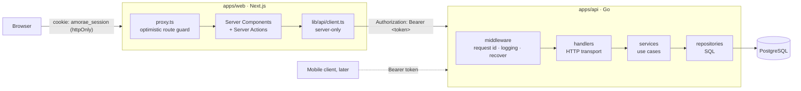

# Amorae architecture

This document explains how the template is put together and, more importantly,
why. If a change you're about to make contradicts something here, either the
change is wrong or this document is out of date. Fix whichever one it is.

What the system must do, and how well, is specified in
[`requirements/`](requirements/README.md). This document is the "how" those
requirements point to. Open decisions and questions are tracked in
[`requirements/05-decisions-and-open-questions.md`](requirements/05-decisions-and-open-questions.md).

## At a glance



There are two deployable apps and one database:

| App | Tech | Role |
| --- | --- | --- |
| `apps/api` | Go 1.26, stdlib `net/http`, pgx, goose | The system of record. Owns every business rule and all data. Knows nothing about browsers. |
| `apps/web` | Next.js 16 (App Router), React 19, Tailwind 4 | A backend-for-frontend (BFF). Renders UI and holds the web session cookie. Holds no business rules. |
| PostgreSQL 18 | | Only the API talks to it. |

## Decisions that shape everything else

1. **Modular monolith, not microservices.** One Go binary, split internally into
   feature modules with interface boundaries. It's one deploy, one
   database, one set of logs. The boundaries still let a module move into its
   own service later if load or team size demands it.
   ([ADR 0001](adr/0001-modular-monolith.md))
2. **The web app is a BFF, and the browser never calls Go directly.** The API
   authenticates with bearer tokens and has no idea what a cookie is. Next.js
   keeps the token in its own httpOnly cookie and forwards it server-to-server.
   That keeps tokens out of client JavaScript, removes CORS from the picture, and
   leaves the API ready for a mobile app without changes.
   ([ADR 0002](adr/0002-bff-and-opaque-sessions.md))
3. **Opaque, revocable session tokens, not JWTs.** Only a SHA-256 hash is stored.
   Logout really logs out, and a leaked database yields no usable tokens.
   ([ADR 0002](adr/0002-bff-and-opaque-sessions.md))
4. **Boring, explainable tooling.** Stdlib router, `log/slog`, plain SQL, goose
   migrations. No ORM, DI container, or code generation to learn before you can
   read the code. ([ADR 0003](adr/0003-stdlib-first.md))

## Backend (`apps/api`)

### Layout

```
cmd/
  api/                 entrypoint: config → logger → app.New → app.Run
  migrate/             goose up | down | status, over the embedded migrations
migrations/            versioned SQL, embedded into both binaries
internal/
  app/                 COMPOSITION ROOT: the only package that knows concrete types
  config/              env → typed Config; fails fast on bad values
  platform/            cross-cutting infrastructure, no business rules
    apperr/            typed errors (Kind + stable Code + safe Message)
    authctx/           "who is calling": user id in context
    database/          pgx pool, Querier, transactions-in-context, dbtest helper
    httpx/             JSON decode/encode, the ONE error→status mapping, Router
    logger/            slog setup, request-scoped logger
    metrics/           Prometheus registry + per-route instrumentation
    middleware/        request id, access logging, panic recovery
    server/            http.Server with timeouts + graceful shutdown
  modules/             one package per feature (vertical slices)
    health/            liveness / readiness
    user/              entity + rules, service, postgres repository, handler, DTOs
    auth/              register / login / logout / authenticate, sessions, middleware
```

### The dependency rule

Dependencies point inward, toward the business rules, and they cross boundaries
only through small interfaces declared by the consumer.

| Layer | File(s) | May import | Must not import |
| --- | --- | --- | --- |
| Handler | `modules/*/handler.go`, `dto.go` | `net/http`, `httpx`, `apperr`, `authctx`, its own module's types | `pgx`, `database` |
| Service | `modules/*/service.go` | its own module's entity/rules, `apperr`, other modules' *types* | `net/http`, `pgx`, `httpx` |
| Repository | `modules/*/repository_postgres.go` | `database`, `pgx`, its own module's types | `net/http`, `httpx` |
| Platform | `platform/*` | the standard library and each other | `modules/*` |
| Composition root | `app/` | everything | (nothing. It's the only place allowed to see it all) |

If a change needs to break this table, the design needs rethinking. Don't add
an exception.

### SOLID, mapped to real code

| Principle | Where it shows up |
| --- | --- |
| **S**ingle responsibility | Handlers only translate HTTP (decode, call, map to DTO, respond). Services only hold use cases. Repositories only run SQL, and they translate driver errors into domain errors (`23505` → `user.ErrEmailTaken`, `ErrNoRows` → `user.ErrNotFound`) so nothing above them imports pgx. |
| **O**pen/closed | A new feature is a new package under `modules/` plus one `RegisterRoutes` line on the versioned router in `app`. Handlers register resource paths (`GET /users/me`); `router.Version(httpx.V1)` is the only place the `/v1` prefix is applied, so a later version does not require editing every module. Error→HTTP mapping is keyed on `apperr.Kind` in one place, so new domain errors need no transport changes. |
| **L**iskov substitution | The in-memory fakes in `auth/service_test.go` and the Postgres repositories satisfy the same interfaces and behave the same way, including returning the same domain errors. That's why the service tests mean anything. |
| **I**nterface segregation | `auth` needs only `Create` + `GetByEmail` from users, so it declares exactly that interface. The Postgres user repository satisfies both `user`'s and `auth`'s interfaces without either knowing about the other's. |
| **D**ependency inversion | Every interface is declared in the package that *consumes* it (the idiomatic Go form of DIP). Services depend on `Repository`, `PasswordHasher` and `TxRunner` abstractions. Only `internal/app` calls concrete constructors. |

### Life of a request

`PATCH /v1/users/me`:

1. **`RequestID`** accepts a sane incoming `X-Request-ID` or mints one, echoes it on the
   response, and puts a request-scoped logger in the context. Every log line
   for this request now carries `request_id`.
2. **`ClientIP`** works out who is really calling: the TCP peer, or the visitor
   IP the web BFF vouches for with its shared secret (see *Rate limiting*).
3. **`Logging`** writes one access-log line when the request finishes.
4. **`Recover`** catches panics so a bug returns a clean 500 and doesn't
   kill the connection. It sits inside RequestID and Logging, so the panic's log
   line and error body carry the request id, and the 500 is still access-logged.
5. **`ServeMux`** matches the method and pattern. The route was registered via
   `Router.HandleAuthed`, so it's wrapped in per-route metrics and **`RequireAuth`**.
   RequireAuth validates the bearer token through the `auth` service and stores the
   user id with `authctx`.
6. The **handler** decodes the body (1 MiB cap, unknown fields rejected) and
   calls `service.UpdateProfile`.
7. The **service** validates with the domain rules in `user.go` and calls the
   repository.
8. The **repository** runs SQL through `db.Q(ctx)`, which transparently uses the
   open transaction when there is one.
9. On error, the handler calls `httpx.Error`. That's the single place an error
   becomes a status code and an envelope.

### Errors

Errors are values of type `apperr.Error`: a `Kind` (maps to HTTP status), a
stable machine-readable `Code` (`email_taken`), a `Message` that is safe to show
a human, optional per-field validation messages, and the wrapped internal cause.

The contract with clients is `code` + `message`. The internal cause is logged
with the request id and **never** sent over the wire. Anything that isn't an
`apperr.Error` is treated as an internal error and becomes a generic 500. That way
a forgotten error translation fails closed and doesn't leak a SQL error.

### Transactions

`database.DB.InTx(ctx, fn)` stores the transaction in the context. Repositories
always go through `db.Q(ctx)`, so they join the transaction when one is open
and use the pool when it isn't. Services compose repositories atomically
without knowing pgx exists:

```go
err := s.tx.InTx(ctx, func(ctx context.Context) error {
    created, err := s.users.Create(ctx, u)   // same transaction…
    ...
    return s.sessions.Create(ctx, session)   // …as this
})
```

### Authentication

- `POST /v1/auth/register` and `/login` return `{token, expires_at, user}`. The token
  is 32 random bytes, base64url encoded. The database stores only its SHA-256.
- Every protected request looks the hash up (`sessions` primary key, so a single
  index hit). Expired sessions are rejected and deleted opportunistically.
- Login runs a bcrypt comparison even when the email doesn't exist, so response
  time doesn't reveal which emails have accounts.
- Passwords are at least 10 characters (counted as Unicode characters) and at
  most 72 bytes. The upper bound is bcrypt's input limit, enforced so longer
  passwords aren't silently truncated. The web app's Zod schema counts the same
  way, so both sides always agree.
- Changing the email (`PUT /v1/users/me/email`, in the auth module because it's
  a credential change) re-checks the current password and shares the
  per-account attempt limit with login. A wrong password is a 400 field error,
  not a 401, which web clients would read as "session expired".

### Rate limiting

Two limits protect the auth endpoints. Each answers a different attack:

| Limit | Where | Stops |
| --- | --- | --- |
| 10 login attempts per account per 15 min | `auth.Service.Login`, before any DB or bcrypt work | Password guessing, even from many IPs. Keyed on the email as typed, so it reveals nothing about which accounts exist. |
| 20 requests per client IP per minute on `/v1/auth/*` | `middleware.RateLimit`, applied in `app` via `v1.With(...)` | bcrypt CPU exhaustion, and enumerating accounts through register's `email_taken` |

A blocked request gets `429 rate_limited` with a `Retry-After` header.

**Which IP?** Browsers never call the API directly, so every web request
arrives from the Next.js server. The web app forwards the visitor's IP in
`X-Client-IP`, and the API believes it only when `X-BFF-Secret` matches its
`BFF_SECRET` (compared in constant time). Everyone else, including mobile
clients and anyone setting headers, is identified by the TCP peer address.
`X-Forwarded-For` is never trusted by the API.

The limiter is in-memory, so limits are per API process: correct for one
instance. Running several replicas needs a shared (Redis) limiter; see the
scaling table.

### Observability

- Structured JSON logs in production (`log/slog`), text in development, and
  `request_id` on every line.
- Prometheus metrics on `GET /metrics`: request count and latency labelled by
  **route pattern** (`/v1/users/me`, not raw paths, which keeps label cardinality
  bounded). Metrics are served on their **own listener** (`METRICS_ADDR`, loopback
  by default), so they can't be reached through the public API port.
- `GET /healthz` (process is up) and `GET /readyz` (database reachable) are
  separate so an orchestrator can take an instance out of rotation without killing it.

## Frontend (`apps/web`)

```
src/
  app/                    routes only. (auth)/welcome,login,register · (onboarding)/couple,join,invite,install,notifications
                          · "/" Home · (app)/together,prayers,history,settings · api/v1/[...path] (BFF front door)
  proxy.ts                optimistic guard: no cookie → /welcome or /login?next= (the API is the real check)
  features/<name>/        api.ts (axios calls) · hooks.ts (React Query) · actions.ts (Server Actions, auth only) · components/
  lib/api/http.ts         the ONLY browser HTTP client (axios → /api/v1) · apiPath`` encodes every id in a URL
  lib/api/client.ts       the ONLY server-side fetch (Server Actions)
  lib/api/envelope.ts     the Go envelopes → data / ApiError, shared by both clients
  lib/api/upstream.ts     headers every server→Go call carries (visitor IP + BFF secret), shared by client + proxy
  lib/api/schemas.ts      Zod schemas: React Hook Form validates with them, Server Actions re-parse with them
  lib/api/types.ts        the contract (snake_case, mirrors docs/API.md)
  lib/query/              client.ts (QueryClient + global policies) · mutations.ts (defineWrite/useWrite)
                          · offline.ts · persist.ts (offline changes across restarts) · keys.ts
  lib/legal.ts            facts the Terms and Privacy pages share (updated date, contact, session length)
  lib/store/              Zustand, client-only state: ui (prayer-mode session, install prompt) · toast
  lib/routes.ts           every in-app URL as a typed builder
  lib/auth/session.ts     the ONLY place that touches the session cookie
  components/ui/          kit.tsx (design system) · query-state.tsx (loading / error / ready for every screen)
  components/layout/      app shell, tab bar, network banner, toaster
```

State is split by kind, and each kind has one home:

| Kind | Where | Why |
| --- | --- | --- |
| Server state (weeks, events, goals, journal…) | React Query, keys in `lib/query/keys.ts` | Caching, optimistic updates (marking a prayer, flipping a switch), invalidation after mutations |
| Changes made offline | React Query paused mutations (`lib/query/client.ts`), saved per user by `lib/query/persist.ts` | Mutations pause while offline, survive a restart, and resume on reconnect; `lib/query/offline.ts` exposes online status and pending changes to the UI |
| Client state that outlives a screen | Zustand (`lib/store`) | The prayer-mode session; the deferred install prompt; the current toast |
| Form state | React Hook Form + Zod (`lib/api/schemas.ts`) | Field errors that say how to fix the problem; the same schema runs again in the Server Action |
| Session | httpOnly cookie, Server Actions only | ADR 0002: the token never reaches JavaScript |

The browser calls `/api/v1/<path>` on this origin through the axios client. The
route handler at `app/api/v1/[...path]/route.ts` attaches the cookie's bearer
token and forwards to `<API_URL>/v1/<path>`, so ADR 0002 still holds with a
client-side data layer: no CORS, no token in JS, one server-side hop.

The proxy only ever reaches `/v1`: it rejects path segments that could climb
out (`x%2F..%2F..%2Freadyz` arrives decoded as one segment and would
otherwise resolve to the API's `/readyz`), and it refuses state-changing
requests from another site (the `Sec-Fetch-Site`/`Origin` rule Go's
`http.CrossOriginProtection` uses), a second line behind `SameSite=Lax`.

**Screens the API hasn't caught up with.** The web app only ever talks to the
real Go API. The screens for prayers, events, goals and the rest are built
against the contract in `docs/API.md`, and Go serves only some of it so far.
Its router answers a path it doesn't know with a bare 404, with none of the
error envelope every real failure carries, so `lib/api/envelope.ts` turns that
into `not_available` and the screen says "Not available yet" where the content
would be (`<QueryState>`), instead of claiming something broke. Build the Go
module and the screen works, with nothing to change on the front end.

The frontend follows the same rules as the backend:

- **Single choke points.** One module makes browser HTTP calls, one makes
  server-side calls, one touches the cookie. Timeouts, error mapping and auth
  headers each live in exactly one place.
- **Features depend on `lib/api`, not the other way round.** A feature can be deleted
  by removing its folder and its routes.
- **Server-only by construction.** Anything that sees the token imports
  `server-only`, so importing it from a client component is a *build* error rather
  than a leaked token.
- **Contract types live in `lib/api/types.ts`** and mirror the Go DTOs in
  [`docs/API.md`](API.md). When the contract changes, both sides change in the same PR.
- **Every screen renders server data through `<QueryState>`.** It is the one
  place that decides loading / failed-with-retry / offline / ready, so no page
  can leave a failed request as a skeleton that spins forever. Page chrome
  (top bar, title) stays outside it.
- **Mutation errors have one handler.** The QueryClient toasts the API's
  user-safe message for any failed write. A form that shows errors inline
  opts out with `meta: { handlesError: true }`. Pages never hand-roll toasts.
- **Effects are for the outside world, not for state.** Subscriptions, timers,
  imperative DOM (the dialog's focus trap), navigation, registering the service
  worker: yes. Copying server data into component state: no. A form takes its
  server values through React Hook Form's `values` with
  `resetOptions: { keepDirtyValues: true }`, never an effect calling `reset()`
  — queries refetch when the window regains focus, and that effect would
  overwrite whatever the person had half-typed (it did, until 2026-09-23).
  Anything you can derive during render, derive during render.
- **Every write is declared once.** Each feature lists its writes in
  `features/<name>/writes.ts` with `defineWrite({ mutationKey, mutationFn,
  invalidates })`. Screens use them through `useWrite(def)`; the QueryClient
  registers the same definitions (`components/providers.tsx`) so a change made
  offline can still be sent after the app restarts. Only optimistic updates
  (marking a prayer, flipping a switch) spell out `useMutation`, and they still
  take their key and API call from the definition.
- **No hand-written URLs.** Links use `routes.*` (`lib/routes.ts`); API calls
  build paths with `apiPath` so an id from the address bar can't add path
  segments.
- **Route files are thin.** They read params and compose feature components;
  derivations (what's "tonight", who set the week) are pure functions in the
  feature folder, not inline JSX.

### Progressive web app

Amorae installs to the home screen on Android, iOS and desktop.
([ADR 0004](adr/0004-pwa-service-worker.md))

| Piece | File |
| --- | --- |
| Manifest (`/manifest.webmanifest`) | `src/app/manifest.ts`, typed, with colours from `src/lib/brand.ts` |
| Icons, iOS splash screens, theme colour | `metadata` / `viewport` in `src/app/layout.tsx`. The splash list is in `src/lib/pwa/startup-images.ts` |
| Service worker | `public/sw.js`, served with no-cache and CSP headers from `next.config.ts` |
| Registration | `src/components/pwa/service-worker-registrar.tsx` (production only) |
| Offline fallback | `src/app/offline/`: static, precached, and never holds user data |

The worker has one rule: **it never caches anything personal.** Pages, RSC
payloads and API calls always go to the network. Only content-hashed static
files and brand assets are cached. When the network is down, navigations get
the offline page.

Inside a running session the app degrades more gently than that: React Query
keeps the last data in memory (`networkMode: "offlineFirst"`), a quiet banner
replaces the content-blocking error, and changes made offline are paused
mutations: their optimistic updates show at once and React Query sends them on
reconnect.

Paused changes also survive the app being closed (`lib/query/persist.ts`,
using `@tanstack/react-query-persist-client`):

- Only paused, registered writes are saved to `localStorage`. The query cache
  never is, so a couple's prayers and journal don't sit on the device.
- They're saved under the signed-in user's id and restored only for that user,
  so one person's pending changes can't be sent from someone else's session.
- They're kept for at most 7 days, and cleared on logout, session expiry and
  account deletion (`clearSignedInState`). The logout confirmation warns when
  changes haven't synced yet.
- The one privacy cost: while a change is pending, its content (say, a journal
  entry typed offline) sits in this browser's storage until it's sent.

The design spec (section 20)
asks for previously loaded prayers to stay readable across a *cold* offline
launch too; that needs the worker to cache per-user data, which this ADR rules
out. Decide one way or the other before launch (see ADR 0004).

To test it, run the production build (`docker compose up --build`), open
http://localhost:3000 in Chrome, and use DevTools → Application → Service
workers. Tick "Offline" and reload any page. `npm run dev` deliberately runs
without a worker.

## Scaling path

The template doesn't make Amorae scalable by itself. What it does is avoid the
decisions that make scaling expensive later: in-process state, business logic in
the UI, and SQL in handlers. When real load shows up, these are the moves, in
roughly the order you'll need them:

| Pressure | Move | Why the template already allows it |
| --- | --- | --- |
| More traffic | Run N API and web replicas behind a load balancer | Both apps are stateless. Sessions live in Postgres, migrations are a separate one-shot job, and shutdown drains in-flight requests. |
| Rate limits across replicas | Replace the in-memory limiter with a Redis-backed one | Both limits consume a one-method `Allow(key)` interface. Only `internal/app` changes. Until then, each replica enforces its own budget. |
| DB connections | Put PgBouncer in front and tune `DB_MAX_CONNS` per replica | The pool size is config. Nothing holds connections across requests. |
| Session lookups hot | Swap the session repository for Redis | `auth.SessionRepository` is an interface. Only `internal/app` changes. |
| Read-heavy pages | Read replica via a second `Querier` for read paths, plus HTTP caching in Next.js | Repositories get their querier from `db.Q(ctx)`, so there's one place to route reads. |
| Slow side effects (email, push, matching) | Transactional outbox + `cmd/worker` | Services already compose writes in `InTx`. Write the event in the same transaction. |
| Large lists | Keyset (cursor) pagination, never `OFFSET` | UUIDv7 keys are time-ordered, so `WHERE id < $cursor ORDER BY id DESC LIMIT n` is index-only. |
| One module outgrows the rest | Extract it into its own service | It already talks to the others through interfaces. Replace the in-process adapter with an HTTP or queue client. |

## Adding a feature module

Say you're adding `matches`:

1. `migrations/0000N_create_matches.sql` with `-- +goose Up` / `-- +goose Down`.
2. `internal/modules/matches/`:
   - `match.go`: entity, validation, sentinel errors (`apperr.NotFound("match_not_found", …)`)
   - `service.go`: use cases, plus the interfaces it needs (`type Repository interface{…}`)
   - `repository_postgres.go`: SQL via `db.Q(ctx)`, driver errors translated to domain errors
   - `handler.go` + `dto.go`: HTTP only. `RegisterRoutes(r *httpx.Router)`
   - `service_test.go` with in-memory fakes, `repository_postgres_test.go` using `dbtest.New(t)`
3. Wire it in `internal/app`: construct the repo, service and handler, and call `RegisterRoutes` on `router.Version(httpx.V1)`. The handler registers `GET /matches/{id}`, not `GET /v1/matches/{id}`.
4. Document the endpoints in `docs/API.md`.
5. Web: add `src/features/matches/{api.ts,actions.ts,components/}`, add types to
   `lib/api/types.ts`, and add routes under `src/app/(app)/`.

## Deliberately not included

These are real product needs. They're left out because the right answer depends
on decisions that haven't been made yet, and a guessed default is worse than an
obvious gap. Each one is tracked as a requirement or an open question in
[`requirements/`](requirements/README.md):

- **Email verification and password reset.** Both need an email provider and a
  worker. Verification is also what fully closes account enumeration: today
  register answers `409 email_taken`, which the per-IP rate limit slows down
  but can't hide. A verify-by-email flow can respond identically either way.
- **Roles and authorisation.** `authctx` carries only the user id today. Extend
  it once the permission model exists.
- **Tracing (OpenTelemetry).** The request id covers correlation until there's
  more than one service.
- **Expired-session sweeping.** Expired rows are deleted when they're used. A
  periodic `DELETE … WHERE expires_at < now()` belongs in the future worker.
- **End-to-end browser tests.** Add Playwright once there are real user
  journeys to protect.
- **Push notifications.** The badge icons are ready, but push needs VAPID keys,
  a subscriptions table in the API and a sender in the worker. That's a
  feature module of its own.
- **An in-app install button.** Chrome and Edge already offer installation
  from the address bar. A custom `beforeinstallprompt` button is a product
  decision.
